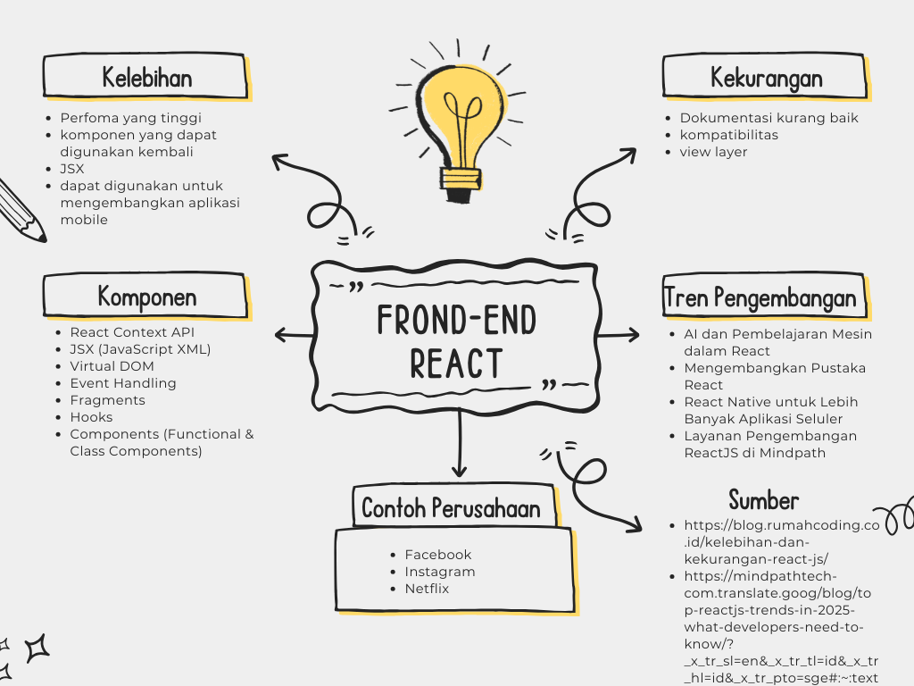

# 📌 Peta Konsep React  

## 👥 Nama Kelompok  
**Lucky Victory, Felix**  

---

## 📌 1. Komponen dalam React  
- **React Context API**  
- **JSX (JavaScript XML)**  
- **Virtual DOM**  
- **Event Handling**  
- **Fragments**  
- **Hooks**  
- **Components (Functional & Class Components)**  

---

## 📌 2. Kelebihan
   - **Perfoma yang tinggi. Dengan adanya Virtual DOM, React js bisa memperbarui data dengan seefisien mungkin. Selain itu, Virtual DOM juga memungkinkan pembuatan aplikasi menjadi lebih cepat dan responsive**
   - **Komponen yang dapat digunakan kembali. Pada React js, anda dapat menggunakan lagi komponen yang sudah anda buat. Sehingga dapat meningkatkan efisiensi dalam pengembangan kode**
   - **JSX. Adanya JSX pada React js memungkinkan Anda untuk memodifikasi DOM menggunakan kode html yang lebih sederhana. Akan tetapi, JSX          bukanlah HTML. Bahasa sederhananya adalah seperti: JSX terlihat seperti HTML, tetapi memiliki fungsi seperti JavaScript.**
   - **Dapat digunakan untuk mengembangkan aplikasi mobile. React js memiliki framework yang dapat digunakan untuk membuat aplikasi mobile          disebut React Native.**

---

## 📌 3. Kekurangan
   - **Dokumentasi kurang baik. Dokumentasi pada React js bisa dibilang kurang baik, karena informasi yang diberikan pada dokumentasi tidak lengkap. Tidak seperti framework lain yang dokumentasi nya lengkap dan terstruktur.**
   - **Kompatibilitas.Browser versi lama tidak mendukung React js, hanya bisa menggunakan browser versi terbaru. Versi terbaru React js hanya mendukung Internet Explorer versi 9 keatas.**
   - **View layer. React js adalah library dengan bentuk view layer. Untuk membangun sebuah aplikasi yang besar kita harus menyusun sendiri tiap-tiap kebutuhan aplikasi yang lain, seperti data layer, router, struktur aplikasi dan event system (kecuali even DOM).**

     ---

## 📌 4. Tren Pengembang 2025
   - **AI dan Pembelajaran Mesin dalam React. React juga akan terintegrasi dengan teknologi pembelajaran mesin, yang memungkinkan pengembang untuk membuat aplikasi yang lebih cerdas. Aplikasi ini akan dapat mengenali foto, memahami suara atau teks, dan memperkirakan   perilaku pengguna. Ini akan membuat situs web dan aplikasi lebih dinamis, cerdas, dan mampu memberikan pengalaman pengguna yang lebih      baik.**
   - **Mengembangkan Pustaka React. Salah satu keunggulan terbesar React adalah ekosistemnya, yang akan terus ditingkatkan pada tahun 2025. Kita dapat mengantisipasi adanya kerangka kerja dan alat tambahan untuk membuat React lebih canggih lagi dalam menangani tugas-tugas seperti manajemen data, navigasi halaman, pencarian informasi, dan pengoptimalan situs web di sisi server.**
   - **React Native untuk Lebih Banyak Aplikasi Seluler. Salah satu keuntungan utama React Native adalah memungkinkan pengembang untuk     menggunakan kembali kode di kedua platform, yang mempercepat dan menyederhanakan pengembangan aplikasi. React Native juga dilengkapi dengan semakin banyak modul asli dan koneksi pihak ketiga yang menyediakan lebih banyak fungsi. Pada tahun 2025, kita dapat      mengantisipasi kemajuan dalam desain React Native, yang akan mengoptimalkan kecepatan dan membawa pengalaman yang lebih dekat dengan       aplikasi asli.**
   - **Layanan Pengembangan ReactJS di Mindpath. Mindpath mengkhususkan diri dalam layanan pemrograman ReactJS berkualitas tinggi yang sesuai dengan kebutuhan spesifik Anda. Pengembang profesional kami mengikuti tren terkini, menjamin bahwa kami menawarkan aplikasi berkualitas tinggi yang berfungsi dengan sangat baik. Kami mengoptimalkan kecepatan menggunakan taktik seperti pemisahan kode dan          pemuatan lambat untuk memberikan pengalaman yang cepat dan lancar kepada pengguna.**

---

## 📌 5. Contoh Perusahaan
   - **Facebook**
   - **Instagram**
   - **Netflix**

sumber :
https://blog.rumahcoding.co.id/kelebihan-dan-kekurangan-react-js/
https://mindpathtech-com.translate.goog/blog/top-reactjs-trends-in-2025-what-developers-need-to-know/?_x_tr_sl=en&_x_tr_tl=id&_x_tr_hl=id&_x_tr_pto=sge#:~:text=Akhiri%20Pikiran!,lanskap%20digital%20yang%20terus%20berkembang.

